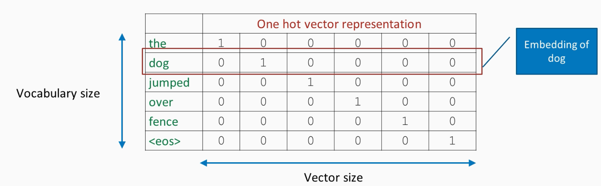
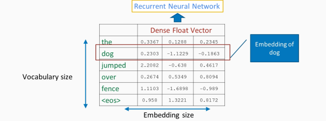

# Notes

Table of Contents
- [Notes](#notes)
  * [Section Two](#section-two)
    + [General](#general)
    + [The Jupyter Notebook](#the-jupyter-notebook)
      - [Loss Function](#loss-function)
      - [Optimizers](#optimizers)
      - [Training It](#training-it)
      - [Outdated Code](#outdated-code)
    + [Convert to GPU](#convert-to-gpu)
  * [Section Three: Computer Vision](#section-three--computer-vision)
    + [Tasks in Computer Vision](#tasks-in-computer-vision)
    + [Operations](#operations)
      - [Convolution Operation](#convolution-operation)
      - [Pooling layer](#pooling-layer)
    + [Preprocessing and Training](#preprocessing-and-training)
    + [Helpful Diagrams and Sites](#helpful-diagrams-and-sites)
      - [Sites](#sites)

<small><i><a href='http://ecotrust-canada.github.io/markdown-toc/'>Table of contents generated with markdown-toc</a></i></small>

## Section Two

### General

Main Topics
* Loss Functions
* Optimizers

#### Neuron Math

Neuron representation:
`output = fn(w1 * ip1 + w2 * ip2 + ... + wn * ipn + bias)`

Can be represented with vector multiply, or matrix-vector multiply when dealing with the whole layer and not just one neuron in it. With matrix, each row represents weights of one neuron in layer.

Matrix math for one layer:
`v_output = activation(W * v_input + v_bias)` 

Activation functions:
Sigmoid(), Tanh(), or ReLU()

#### Backpropagation

Intuiting gradient descent:
Imagine a small submarine trying to find the deepest point in a body of water. The submarine has limited visibility distance. It descends to the lake/sea floor, then observes the slope of the floor at that point. From there, it attempts to follow the slope deeper. However, it could run into local minima, the deepest point in one part of the body of water, but not the deepest point overall.

With backpropagation, we compare desired output of a layer to actual output, then apply an adjustment to that layer's weights. Adjustment is propagated backwords from higher layers to lower.

### The Jupyter Notebook

150 flower instances, 80% for training, 20% for validation

Custom module based on nn.Module

`__init__()` method:
creates layers, activation function

`forward()` method:
passes inputs through all layers, leading to output

One `DataLoader` for training set, one for test set. Notice use of "shuffle".

Install pandas with:
`$ conda install -c anaconda pandas`

#### Loss Function
Compares outputs of model to actual ground truth
Objective is to reduce loss score

PyTorch has a whole supply of loss functions, such as `CrossEntropyLoss`
Example: class 0, apple, 0.02 | class 1, mango, 0.88 | class 2, banana, 0.1 --> class 1 is winner

#### Optimizers
Optimization problem: problem of finding best solution from all feasible ones, e.g. best supermarket register to get in line at.

Calculate gradients of loss WRT to model parameters, then update model weights. That's a single iteration.

Provided optimizers in PT: `SGD`, `Adadelta`, `Adam`, `RMSprop`, etc.
Parameters:
* learning rate: step size in direction of lower loss (too big, it might not converge; too small, it might take too long). Must be deduced through experimentation. Active area of research.

#### Training It

Outer loop: iterates through epochs
Inner loop: iterate through all 120 items in training set

Inner loop steps:
* set up inputs and desired outputs: "items", "classes"
* prepare for training
* clear the gradients with zero_grad
* calculate loss
* do backprop to find gradients
* adjust model params based on gradients

#### Outdated Code

Replace `loss.data[0]` with `loss.item()`

### Convert to GPU

(It's basically just adding a `cuda()` call in certain places.)
```
# first replacement
net = IrisNet(4, 100, 50, 3).cuda()

# inner loop
items = Variable(items.cuda())
classes = Variable(classes.cuda())

# last part
outputs = net(Variable(test_items.cuda()))
loss = criterion(outputs, Variable(test_classes.cuda()))
test_loss.append(loss.item())
_, predicted = torch.max(outputs.data, 1)
total = test_classes.size(0)
correct = (predicted == test_classes.cuda()).sum()
test_accuracy.append((100 * correct / total))
```

Don't expect much GPU improvement for lightweight data set compared to running on CPU. Makes more of a difference with image processing.

## Section Three: Computer Vision

### Tasks in Computer Vision

* Classification (e.g. detect cat in photo)
* Classification + localization (e.g. detect cat in photo and establish its coordinates)
* Object detection (e.g. recognize both cat and dog in photo)
* Instance segmentation (e.g. find all cars in photo and highlight each with a different color)

Total pixels in typical image
1265 x 949 = 1200485 pixels, 3 channels
It's impossible to have a fully-connected layer process all this data.
In CNN, convolutional layers have a sliding window of limited size (can be thought of as a moving neuron) that learns salient features

Spacial relationship important, don't want to lose structure
Simple NN can't do job

### Operations

* convolution
* activation
* pooling: max, average

#### Convolution Operation

Imagine 3 x 3 window sliding across input image. Left cells contain -1, right cells contain 1 (for example -- could be other values). Window is kernel.
Result for a single position (with x,y being where center of kernel is on input image): 
* pix[x-1][y-1] * -1 + pix[x-1][y] * -1 + pix[x-1][y+1] * -1 + pix[x+1][y-1] * 1 + pix[x+1][y] * 1 + pix[x+1][y+1]
Stride: number of pixels kernel moves in one step
* stride is hyperparameter
Padding: extra pixels (zero value added around borders of input image)
Output activation map: result of operation

Important class
`torch.nn.Conv2d(in_channels, out_channels, kernel_size, stride, padding, etc...)`

Training
* kernel's weights are learned through training, much as with weights in fully connected NN layer
* number of kernels are determined by number of channels in incoming layer, number of channels desired in outgoing layer

#### Pooling layer

Another sliding window with stride, but different math:
* max: choose max pixel within window
* average: average of all pixels

### Preprocessing and Training

MNIST Dataset: database of handwritten digits, 0 -  9. 60k training images, 10k test images. Greyscale.

Image normalization (preprocessing step)
* want pixels to have mean of 0, standard deviation of 1
* calculate mean, stddev for of each channel for all images in dataset
* normalize each pixel with mean, stddev
* helps network learn fast, have better gradient

Dropout
* handy technique to prevent overfitting to training set
* deactivate some number of neurons at random -- reduces overdependence on any neurons in particular

### Helpful Diagrams and Sites

     
`Convolution`     

     
`Pooling`    

     
`Layers of CNN`    

#### Sites

Explanation of Convolutions by 3Blue1Brown: https://www.youtube.com/watch?v=KuXjwB4LzSA
Explanation of CNNs by StatsQuest: https://www.youtube.com/watch?v=HGwBXDKFk9I

## Section Four: Sequence Models -- RNN for Text Generation

Other info sources:
* https://www.simplilearn.com/tutorials/deep-learning-tutorial/rnn

### Sequence Models Motivation

CNNs are good with spatially invariant data (e.g. lines can be anywhere in the image). 

RNNs exploit temporal invariance. They deal with sequential data, with recurring patterns over time.

Uses:
* Text autocomplete
* Machine translation
* Sentiment analysis
* Predicting stock prices
* Named entity recognition, e.g. finding mention of celebrities in news articles

### Word embedding

How can we convert words into numbers? (Since NNs deal with numbers.)

Corpus
* the sentence, e.g. "The dog jumped over the fence."

Vocabulary
* unordered set of all words representing problem domain, e.g. "dog", "over", "the" etc.

#### Numerical representation of text

##### Method One: One Hot Encoding



Problem: matrix gets way too big. Vector for a word would not hold meaning.

##### Method Two: Word Embedding



Advantages:
Matrix is dense and of reduced dimension. Contextual similarity between words. Each dimension tries to capture a certain characteristic of vocabulary, e.g. gender aspect.

Contextual similarity:
* if gender is a characteristic of interest, "man" and "king" are similar, while "woman" and "queen" are similar
* if verb test is a characteristic of interest, "walking" and "swimming" are similar, while "walked" and "swam" are similar

Normally, it is better to use industry-standard, pre-trained models.

### RNNs

RNNs are good at data that has temporal aspect.

Consider: "Apple is a type of fruit. It is red in color."
Want to connect "Apple" and "It", "Apple" and "fruit", "Apple" and "red".
Must have memory of words it encountered earlier.
Therefore, each cell has memory of state of earlier cell.

#### Weights and Dimensions

Model dimensions:
* batch size `b`: a batch is set of sequences (sentences) passed into network to train it
* embedding size `e`: size of vector that represents a word
* vocabulary size `v`: number of words in vocabulary
* hidden units `h`: number of hidden layers?

Back Propagation Through Time Size (BPTT size): how many steps back through time to perform backpropagation. This is hyperparameter.

Input `X`: a vector whose length matches embedding size

#### Types of RNNs

* Vanilla: no recurrence
* One-to-many: in image captioning, we take in the image at `t(0)`. Subsequent time steps used to generate each word of caption text.
* Many-to-one: in sentiment classification, we take in words as input during steps `t(0)` to `t(n)`. At `t(n)` we spit out sentiment analysis.
* Many-to-many: in translation, we take in `n` words in language A, then at `t(n)` we begin outputting translated text.
* Many-to-many: in video classification, video changes at each time step

#### Problems

* Vanishing gradient: gradients get smaller and less meaningful as they pass back in time
* Exploding gradient: gradients get larger as they pass back through time