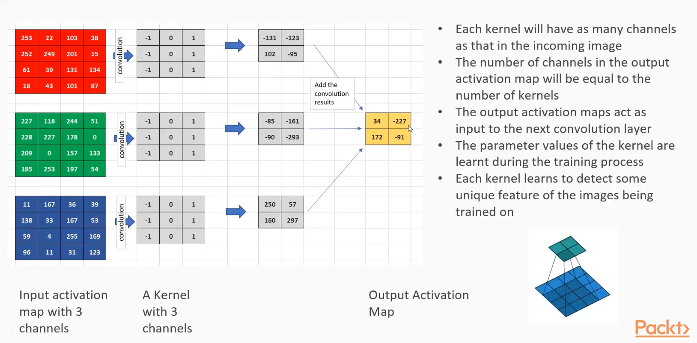
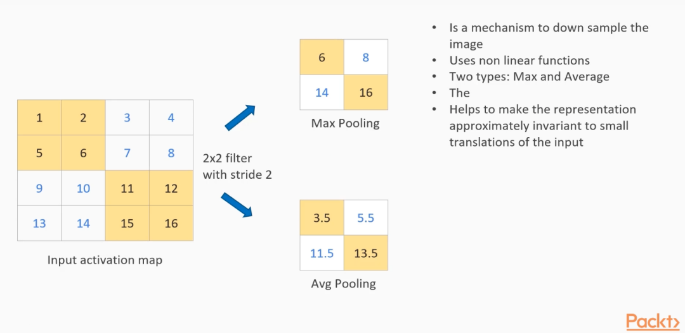
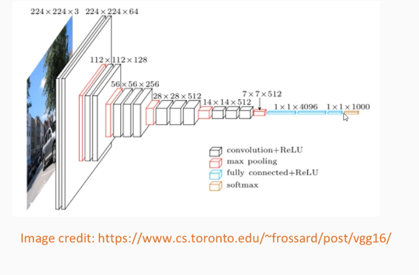

# Notes

## Section Two

### General

Main Topics
* Loss Functions
* Optimizers

Neuron representation:
`output = fn(w1 * ip1 + w2 * ip2 + ... + wn * ipn + bias)`

(Can be represented with vector multiply, or matrix-vector multiply when dealing with the whole layer and not just one neuron in it)

Activation functions:
Sigmoid(), Tanh(), or ReLU()

### The Jupyter Notebook

150 flower instances, 80% for training, 20% for validation

Custom module based on nn.Module

`__init__()` method:
creates layers, activation function

`forward()` method:
passes inputs through all layers, leading to output

One `DataLoader` for training set, one for test set. Notice use of "shuffle".

Install pandas with:
`$ conda install -c anaconda pandas`

#### Loss Function
Compares outputs of model to actual ground truth
Objective is to reduce loss score

PyTorch has a whole supply of loss functions, such as `CrossEntropyLoss`
Example: class 0, apple, 0.02 | class 1, mango, 0.88 | class 2, banana, 0.1 --> class 1 is winner

#### Optimizers
Optimization problem: problem of finding best solution from all feasible ones, e.g. best supermarket register to get in line at.

Calculate gradients of loss WRT to model parameters, then update model weights. That's a single iteration.

Provided optimizers in PT: `SGD`, `Adadelta`, `Adam`, `RMSprop`, etc.
Parameters:
* learning rate: step size in direction of lower loss (too big, it might not converge; too small, it might take too long). Must be deduced through experimentation. Active area of research.

#### Training It

Outer loop: iterates through epochs
Inner loop: iterate through all 120 items in training set

Inner loop steps:
* set up inputs and desired outputs: "items", "classes"
* prepare for training
* clear the gradients with zero_grad
* calculate loss
* do backprop to find gradients
* adjust model params based on gradients

#### Outdated Code

Replace `loss.data[0]` with `loss.item()`

### Convert to GPU

(It's basically just adding a `cuda()` call in certain places.)
```
# first replacement
net = IrisNet(4, 100, 50, 3).cuda()

# inner loop
items = Variable(items.cuda())
classes = Variable(classes.cuda())

# last part
outputs = net(Variable(test_items.cuda()))
loss = criterion(outputs, Variable(test_classes.cuda()))
test_loss.append(loss.item())
_, predicted = torch.max(outputs.data, 1)
total = test_classes.size(0)
correct = (predicted == test_classes.cuda()).sum()
test_accuracy.append((100 * correct / total))
```

Don't expect much GPU improvement for lightweight data set compared to running on CPU. Makes more of a difference with image processing.

## Section Three: Computer Vision

### Tasks in Computer Vision

* Classification (e.g. detect cat in photo)
* Classification + localization (e.g. detect cat in photo and establish its coordinates)
* Object detection (e.g. recognize both cat and dog in photo)
* Instance segmentation (e.g. find all cars in photo and highlight each with a different color)

Total pixels in typical image
1265 x 949 = 1200485 pixels, 3 channels
It's impossible to have a fully-connected layer process all this data.
In CNN, convolutional layers have a sliding window of limited size (can be thought of as a moving neuron) that learns salient features

Spacial relationship important, don't want to lose structure
Simple NN can't do job

### Operations

* convolution
* activation
* pooling: max, average

#### Convolution Operation

Imagine 3 x 3 window sliding across input image. Left cells contain -1, right cells contain 1 (for example -- could be other values). Window is kernel.
Result for a single position (with x,y being where center of kernel is on input image): 
* pix[x-1][y-1] * -1 + pix[x-1][y] * -1 + pix[x-1][y+1] * -1 + pix[x+1][y-1] * 1 + pix[x+1][y] * 1 + pix[x+1][y+1]
Stride: number of pixels kernel moves in one step
* stride is hyperparameter
Padding: extra pixels (zero value added around borders of input image)
Output activation map: result of operation

Important class
`torch.nn.Conv2d(in_channels, out_channels, kernel_size, stride, padding, etc...)`

Training
* kernel's weights are learned through training, much as with weights in fully connected NN layer
* number of kernels are determined by number of channels in incoming layer, number of channels desired in outgoing layer

#### Pooling layer

Another sliding window with stride, but different math:
* max: choose max pixel within window
* average: average of all pixels

### Preprocessing and Training

MNIST Dataset: database of handwritten digits, 0 -  9. 60k training images, 10k test images. Greyscale.

Image normalization (preprocessing step)
* want pixels to have mean of 0, standard deviation of 1
* calculate mean, stddev for of each channel for all images in dataset
* normalize each pixel with mean, stddev
* helps network learn fast, have better gradient

Dropout
* handy technique to prevent overfitting to training set
* deactivate some number of neurons at random -- reduces overdependence on any neurons in particular

### Helpful Diagrams and Sites

     
`Convolution`     

     
`Pooling`    

     
`Layers of CNN`    

#### Sites

Explanation of Convolutions by 3Blue1Brown: https://www.youtube.com/watch?v=KuXjwB4LzSA
Explanation of CNNs by StatsQuest: https://www.youtube.com/watch?v=HGwBXDKFk9I

