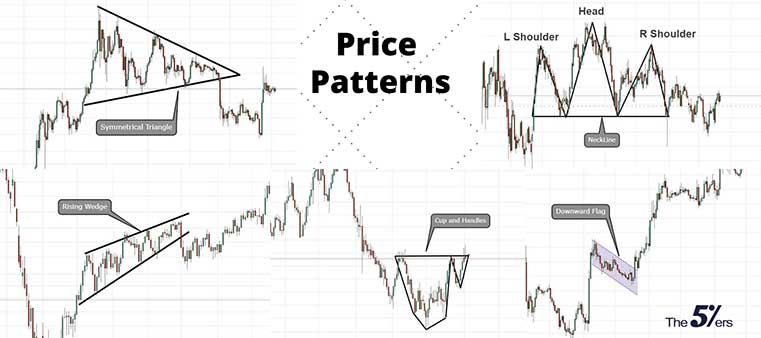
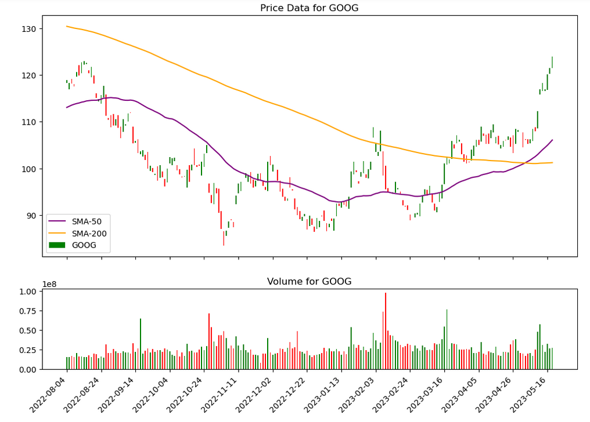
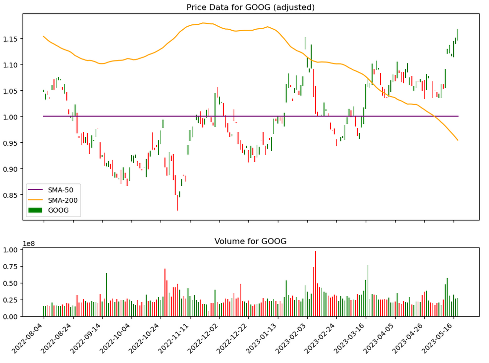

# Stock Chart Analysis Experiments

## Overview

Stock trading relies heavily on the art/science of technical analysis, which involves analyzing the historical price/volume data of a particular security to find patterns and trends in its movement. Consider the charts as reflecting the emotions of the market. Over the long-term, the market approaches something like rationality in valuing stocks, but in the short-term, price movements are more driven by greed and fear. For example, if you consider the "cup and handle" formation above, this shows a stock price bottoming out, then rising back to an earlier level (the cup). At that point, many owners of the stock question its ability to rise past an earlier price point, so there's a sell-off. But, with this second sell-off, there's more conviction among buyers, as they don't let the price drop as far as it did in the "cup". Thus, the "handle" forms. This classic formation often indicates that price will go higher.

In the "symmetrical triangle" formation, a battle between buyers and sellers can be seen. The tug-of-war initially goes back and forth, but becomes a stalemate. When the stalemate is finally broken, the stock tends to run in one direction or the other, often triggered by some news item that sets off a new wave of emotion. Think of a herd of steer panicked by a lightening bolt -- they stampede from one side of the pen to the other, then back again, eventually calming down. Then, another lightning bolt strikes and they panic again.

With technical analysis, there's also a tail-wagging-the-dog effect at work. Since everyone in the world of stocks and bonds is using technical analysis to some extent, it becomes a self-reinforcing phenomena. If you're a fund manager, and you see a stock's price approaching an important trend line or moving average, you can bet that all other fund managers, aware of the same basic playbook, have the same fact in mind, and know that you probably do as well. Thus, it becomes a self-fulfilling prophecy. Well, not always, but it happens often enough to be a factor.

Underneath the highly mercurial behavior of retail traders and short-term trading algorithms can be seen something of the agenda of more long-term investors, notably big funds. These tend to make moves a little at a time, like a large ship slowly turning into a harbor. Traders applying technical analysis on longer time scales can discern these moves. The idea is, if you observe the ship, you can guess where it's probably going. And if you're in a small boat, maybe you can trail along behind, letting the big ship clear your way. Usually, that's a better outcome than being in the path of the ship.

While insider trading is technically illegal, the well-connected always have information that the public doesn't, and few compunctions against exploiting it for their own gain (which probably isn't a surprise to anyone aware of the politics of the US and other wealthy countries). Since the well-connected control a lot more shares than the average person does, it can pay to watch for their moves amid the overall market noise.

That's the theory of TA, anyway.

Ever since Deep Learning burst into public awareness, stock analysis has become a popular area of application for these techniques. Certainly, plenty of YouTube videos cover the topic to some extent. Unfortunately, many of these are made by people whose understanding of Deep Learning or stock trading (or both) is pretty limited, and some of the information is questionable -- though still propagated by the stock bro community.

## Purpose of This Project

This project contains a framework for collecting and visualizing stock data, then applying Deep Learning to it via PyTorch.

Folders:

| Folder      | Purpose                                                                                               |
|-------------|-------------------------------------------------------------------------------------------------------|
| `core/`     | Code for collecting and storing price/volume data, and for adding various technical indicators to it. |
| `ui/`       | Code for the visual display of stock charts.                                                          |
| `learning/` | To be added.                                                                                          |

Key Classes:

| Class       | Purpose                                                                                                                                                                                                |
|-------------|--------------------------------------------------------------------------------------------------------------------------------------------------------------------------------------------------------|
| `Ticker`    | Holds raw stock data, scraped from the web and cached to disk.                                                                                                                                         |
| `Chart`     | For applying extra indicators (such as Simple Moving Average) to price data; these can be helpful for analysis. Also provides functions for returning data in a form that's digestible by an ML system. |
| `MPLHelper` | For plotting data in a `matplotlib` chart.                                                                                                             |

### Adjusted Data

In my opinion, raw price data isn't in an ideal format for DL analysis. Most (tradeable) stocks see their value increase exponentially over years, so a neural network that worked well on prices ranging from $10 to $100, would probably struggle with prices ranging from $500 to $1000, and vice-versa.

My special innovation (I'm sure others have thought of it) is to adjust a chart from showing absolute price data to showing price data relative to a particular Simple Moving Average. That moving average becomes a horizontal line with a value of 1.0, and all price data is expressed as a multiplier.

    
`Regular Price Data`

    
`Adjusted Price Data`

## Deep Learning Applications

### Exploration One

This will be a very simple "vanilla" NN, which acts upon daily signals with no direct awareness of what happened on earlier days. However, when indicators such as moving averages or the MACD oscillator are added to the chart, these implicitly reflect past history. Thus, the NN will be able to infer something about the trends that are in progress on a given day (for example, if the value of a short-term SMA is above that of a longer-term SMA, that often indicates an uptrend).

The desired output of the NN will simply be the answer to the question, "is today a good day to buy the stock?"

An easy set of criteria for determining that might be:
* From day `n` onward, does the stock price achieve a certain percentage in gain without declining from its starting value (on day `n`) by another percentage?
* Is the profit target achieved within a certain number of days? (Ordinarily, when trading stocks, time spent in a position that's slow to produce results represents an opportunity cost. However, when trading options, we might prefer to find situations where the stock price DOESN'T move.)